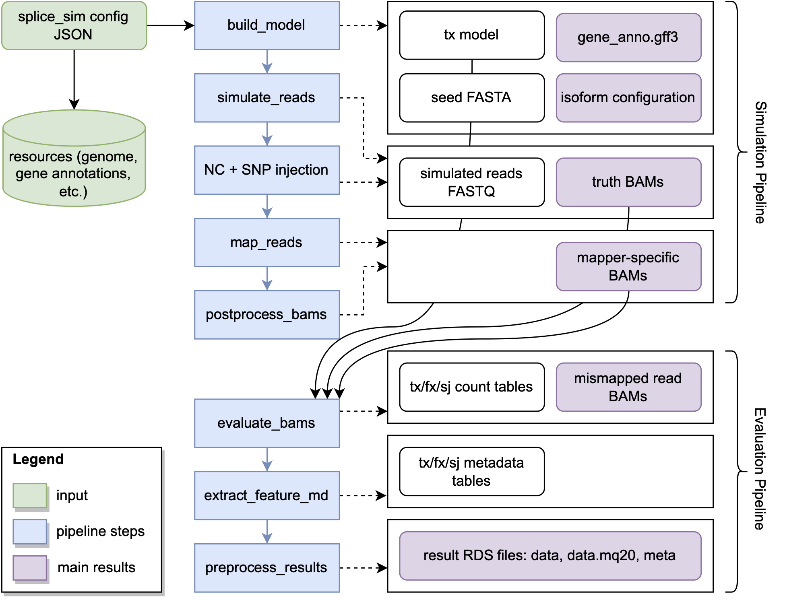

# splice_sim

`splice_sim` is a python based RNA-seq simulation and evaluation package specialized on the simulation nucleotide-conversions and splice isoforms. We use [Nextflow](https://www.nextflow.io/) and containerization via [Docker](https://hub.docker.com/repository/docker/tobneu/splice_sim) to wrap `splice_sim` into a readily executable start-to-end framework for simulating and evaluating complex experimental scenarios with mapping based processing pipelines.

Contents
========

 * [Features](#features)
 * [Installation](#installation)
 * [Usage](#usage)
 * [Configuration](#configuration)
 * [Output Structure](#output-structure)

Features
========


+ Realistic Illumina short-read simulation using [ART](https://doi.org/10.1093/bioinformatics/btr708)
+ Simulation of customizable nucleotide-conversions at configurable rates
+ Simulation of isoforms at configurable splicing states per transcript
+ Mapping accuracies and performance metrics at different scopes of genomic annotation
+ Elaborate output tracks for visual inspection stratified by performance metric

Installation
============

`splice_sim` itself is a python package with several dependencies that are best simply installed in a [conda environment](https://conda.io/projects/conda/en/latest/user-guide/tasks/manage-environments.html):

```bash
conda env create -f environment.yml
```

Then clone the `splice_sim` repository and call its main method:

```bash
git clone https://github.com/popitsch/splice_sim.git
cd splice_sim
python main.py
```

To run our full-blown all-on-one Nextflow based workflow, you simply need to install [Nextflow](https://www.nextflow.io/) and [Docker](https://docs.docker.com/get-docker/) to have all dependencies available and be ready to go. To run `splice_sim` on HPC environments, most administrators prefer [Singularity](https://docs.sylabs.io/guides/3.5/user-guide/introduction.html) (apptainer) containers which can be seamlessly created from our [Docker container](https://hub.docker.com/repository/docker/tobneu/splice_sim).

Usage
=====

`splice_sim` itself is the Python package and includes the simulation engine to both simulate and evaluate datasets. `splice_sim` provides dedicate commands for the individual logical steps outlined below, starting from creating transcript models, simulating reads from those transcripts and finally evaluating the performance of a given mapper via the produced bam file. The parameters for the highlighted relevant steps for such a process are described [in the `splice_sim` engine](#splice_sim-engine).  <br /><br /> We have also wrapped a ready-to-use out of the box workflow that executes all step from start to end into our Nextflow workflow with a description provided in the [adjacent section](#nextflow-workflow). We provide two separate workflows: **(i)** `splice_sim.nf` that handles the entire logic contained in the **Simulation Pipeline** block and **(ii)** `splice_sim_eva.nf` that handles everything related to the **Evaluation Pipeline** block in the diagram below. To avoid supplying an extensive set of parameters to theindividual steps via the command line, we designed `splice_sim` to be driven by a **[configuration file](#configuration)** in [json format](https://www.json.org/json-en.html) that contains all necessary inputs and parameters needed for any of `splice_sim` steps. <br /><br />



## Nextflow workflow

All you need to get started with our workflows is [Nextflow](https://www.nextflow.io/) and [Docker](https://docs.docker.com/get-docker/). Typically one would also need to tweak the resource requirements for each of the processes that are executed. We did that already for you for the small (typically expressed genes size) and large (full transcriptome) datasets simulated in our study in the provided `nextflow.config.example` ready to use. Both workflows need as only input the [configuration file](#configuration) file provided by the user.

### Simulation workflow `splice_sim.nf`

This workflow executes the following steps to obtain the simulated truth alignments and mapped read alignments of the mappers under investigation in BAM format as final output:

* Build a transcript model with `splice_sim build_model`
* Simulate reads with [ART](https://doi.org/10.1093/bioinformatics/btr708) for all conditions
* Calculate and encode truth alignments for all conditions
* Map simulated reads with mappers under investigation for all conditions
* Postprocess BAM files with `splice_sim postfilter_bam`

### Evaluation workflow `splice_sim_eva.nf`

This workflow executes the following steps to obtain the evaluation metrics and output files from the simulated truth alignments and mapped read alignments of the mappers under investigation as final output:

* Evaluate a given read alignment of a mapper with `splice_sim evaluate`
* Extract associated metadata of the annotated features under investigation with `splice_sim extract_feature_metadata`
* Bundle, package and compress the produced output tables into RDS files to futher process in R with [`preprocess_results.R`](#processing-results-into-r-objects-rds)

## `splice_sim` engine

The core `splice_sim` python engine covers isolated steps of the simulation and evaluation process process as highlighted in the previous block diagram. The most important commands along the way a documented in this section.

### build_model

The `build_model` command takes the reference and configuration provided by the user and creates the transcript model and sequence files needed that contains the composition of the transcriptome and serves and input to the read simulation step of `splice_sim`.

```shell
 python splice_sim/main.py build_model --help
usage: main.py [-h] -c config_file [-o outdir]

  Copyright (C) 2021 XXX.  All rights reserved.

  Distributed on an "AS IS" basis without warranties
  or conditions of any kind, either express or implied.

USAGE

optional arguments:
  -h, --help            show this help message and exit
  -c config_file, --config config_file
                        JSON config file
  -o outdir, --outdir outdir
                        output directory (default is current dir)
```
### create_genome_bam

The `create_genome_bam` command takes the simulated read set with your short-read simulator of choice (we use [ART](https://www.niehs.nih.gov/research/resources/software/biostatistics/art/index.cfm)) and calculates the truth alignments that serve as the reference benchmark in `splice_sim`.

```shell
python splice_sim/main.py create_genome_bam --help
usage: main.py [-h] -m model_file -a config_file [-t threads] [-o outdir]

  Copyright (C) 2021 XXX.  All rights reserved.

  Distributed on an "AS IS" basis without warranties
  or conditions of any kind, either express or implied.

USAGE

optional arguments:
  -h, --help            show this help message and exit
  -m model_file, --model model_file
                        model file
  -a config_file, --art_sam config_file
                        ART sam file
  -t threads, --threads threads
                        threads
  -o outdir, --outdir outdir
                        output directory (default is current dir)
```

### postfilter_bam

The `postfilter_bam` command filters secondary and supplementary reads and highlights isoforms.

```bash
python splice_sim/main.py postfilter_bam --help
usage: main.py [-h] -c config_file -b bam_file -o outdir

  Copyright (C) 2021 XXX.  All rights reserved.

  Distributed on an "AS IS" basis without warranties
  or conditions of any kind, either express or implied.

USAGE

optional arguments:
  -h, --help            show this help message and exit
  -c config_file, --config config_file
                        JSON config file
  -b bam_file, --bam bam_file
                        input bam file
  -o outdir, --outdir outdir
                        output dir
```

### evaluate

The `evaluate` command runs the `splice_sim` evaluation routine on a given mapper bam file produced for a condition of the `splice_sim` simulation run.

```bash
python splice_sim/main.py evaluate --help
usage: main.py [-h] -b bam_file -c config_file -m model_file [-f filter_bed] [-t THREADS] -o outdir

  Copyright (C) 2021 XXX.  All rights reserved.

  Distributed on an "AS IS" basis without warranties
  or conditions of any kind, either express or implied.

USAGE

optional arguments:
  -h, --help            show this help message and exit
  -b bam_file, --bam_file bam_file
                        input bam file
  -c config_file, --config config_file
                        JSON config file
  -m model_file, --model model_file
                        model file
  -f filter_bed, --filter_bed filter_bed
                        Filter regions BED file
  -t THREADS, --threads THREADS
                        used threads
  -o outdir, --outdir outdir
                        output dir
```

### extract_feature_metadata

The `extract_feature_metadata` extracts comprehensive metadata that lists various characteristics of the genomic features under evaluation.

```bash
python splice_sim/main.py extract_feature_metadata --help
usage: main.py [-h] -c config_file -m model_file -o outdir

  Copyright (C) 2021 XXX.  All rights reserved.

  Distributed on an "AS IS" basis without warranties
  or conditions of any kind, either express or implied.

USAGE

optional arguments:
  -h, --help            show this help message and exit
  -c config_file, --config config_file
                        JSON config file
  -m model_file, --model model_file
                        model file
  -o outdir, --outdir outdir
                        output dir
```

## Running `splice_sim` with Docker

All the above commands of the `splice_sim` engine can be run without installing any dependencies out of the box of our Docker container. Simply precede the individual `splice_sim` calls like illustrated below:

```bash

docker run --cpus <number of CPUS> -m <GB memory>g -v $(pwd):$(pwd) -w $(pwd) tobneu/splice_sim:release python <path to splice_sim repository>/main.py

```

# Processing results into R objects (RDS)

We provide a Rscript that takes all `splice_sim` evaluation outputs and processes them into readily usable RDS objects to be imported in R. The script is located in `splice_sim/src/main/R/splice_sim/preprocess_results.R` and all dependencies are again wrapped into our `splice_sim` [R Docker container](https://hub.docker.com/repository/docker/tobneu/splice_sim_r) `tobneu/splice_sim_r:latest`.

```bash
Rscript --vanilla splice_sim/src/main/R/splice_sim/preprocess_results.R

Error: usage: preprocess_results.R <splice_sim_config> [<outdir>]
Execution halted

```

Configuration
=============

We made the deliberate decision to have a central configuration file in [json format](https://www.json.org/json-en.html) that encapsulate and document all input files and parameters that are driving all `splice_sim` related processes. Here we document all required and optional parameters:

| Parameter            | Description    | Required  |
|----------------------|----------------|:---------:|
| `dataset_name`       | Name of the simulation run        | &#9989;   |
| `splice_sim_cmd`       | Path to `main.py` in the clone splice_sim repository        | &#9989;  |
| `splice_eva_preprocess_cmd` | Path to `main.py` in the cloned `splice_sim` repository        | &#9989;  |
| `gene_gff` | Path to the transcriptome annotation in [gff3-format](https://www.ensembl.org/info/website/upload/gff3.html) (obtained e.g. from [Gencode](https://www.gencodegenes.org/)        | &#9989;  |
| `intron_gff` |Annotated introns from the transcriptome annotation in [gff3-format](https://www.ensembl.org/info/website/upload/gff3.html)        | &#9989;  |
| `genome_fa` | Reference genome sequence in fasta format        | &#9989;  |
| `genome_chromosome_sizes` | Chromosome lengths file with chromosome name and chromosome lengths separated by a tab as produced by `samtools faidx`      | &#9989;  |
| `genome_conservation` | Genome conservation score in [bigwig format](https://genome.ucsc.edu/goldenPath/help/bigWig.html) (obtained e.g. from [UCSC](https://hgdownload.cse.ucsc.edu/goldenpath/hg38/))     | &#10060;  |
| `genome_mappability` | Genome mappability score in [bigwig format](https://genome.ucsc.edu/goldenPath/help/bigWig.html) (obtained e.g. from the [Hoffman lab]([https://hgdownload.cse.ucsc.edu/goldenpath/hg38/](https://bismap.hoffmanlab.org/)))     | &#10060;  |
| `transcript_data` | Transcript state configuration file      | &#10060;  |
| `transcript_ids` | Subset of transcript IDs from the reference annotation used in this simulation      | &#9989;  |
| `isoform_mode` | Fraction of unspliced to mature spliced transcripts      | &#9989;  |
| `frac_old_mature` | Fraction of pre-existing fully-spliced transcripts before labelling onset      | &#9989;  |
| `condition`       | Dictionary of the conditions in this simulation defining the base conversion type (`ref` and `alt` base), `conversion_rates` (list of doubles between 0 and 1) and the `base_coverage` (integer)  | &#9989;  |
| `mappers`       | Dictionary of dictionary of the mappers employed and evaluated in this simulation defining the name of the mapper, the command how to call it, the mapping index and known splice sites file  | &#9989;  |
| `create_tdf`       | Boolean whether [TDF files](https://github.com/igvteam/igv/wiki/TDF-Format) for track visualization in [IGV](https://software.broadinstitute.org/software/igv/) should be produced | &#9989;  |
| `max_ilen`       | Integer defining the maximum considered intron length | &#9989;  |
| `min_abundance`       | Integer defining the minimum abundance value fo a transcript to be considered | &#9989;  |
| `random_seed`       | Integer seed to keep simulation deterministic | &#9989;  |
| `readlen`       | Integer defining the short read length | &#9989;  |
| `write_reads`       | Boolean value defining whether reads should be output to disk or not |  &#10060; |
| `write_intron_bam`       | Boolean value defining whether intronic reads should be written to BAM file not | &#10060;  |
| `pre_exist`       | Directory of pre-existing runs to restart the simulation in case a run crashes |  &#10060; |
| `snp_file`       | Optional VCF file containing SNVs to be injected into the simulated data. The VCF file may contain the following (optional) properties in the INFO section: **prob**: conversion probability [0; 1] (optional, default:1), **strand**: strand specificity [NA, +, -] (optional, default:NA), **enable_nc**: [yes, no] (optional, default: yes) if yes, configured NC are possible at the same position if no SNV was injected |  &#10060; |


Find below an example config json:

```json
{
    "dataset_name": "test_simulation",
    "splice_sim_cmd": "python /software/splice_sim/main.py", # should point to your local splice_sim clone
    "splice_eva_preprocess_cmd": "Rscript --vanilla /software/splice_sim/src/main/R/splice_sim/preprocess_results.R", # should point to your local splice_sim clone
    "gene_gff": "/references/gencode.vM21.gff3.gz", # gene annotation GFF3 file
    "genome_fa": "/references/Mus_musculus.GRCm38.dna.primary_assembly.fa",
    "genome_chromosome_sizes": "/references/Mus_musculus.GRCm38.dna.primary_assembly.fa.chrom.sizes",
    "genome_conservation": "/references/mm10.60way.phastCons60wayEuarchontoGlire.bw", # optional
    "genome_mappability": "/references/mm10.k24.umap.bedgraph.gz", # optional
    "transcript_data": "data.config.json", # if this file exists, 
    "transcript_ids": "tids.tsv", # optional (TSV file with one column 'transcript_id' containing all considered transcript ids)
    "isoform_mode": "1:1", # mode for creating isoform data; '1:1': mat and pre form as in paper (default), 'from_file': data will be loaded from 'transcript_id','abundance','frac_mature','frac_old_mature' columns in the configured transcript_ids file
    "frac_old_mature": 0, # fraction of OLD RNA that was not exposed to a nucleotide analog 
    "condition": {
        "ref": "T", # reference base
        "alt": "C", # alternat base
        "conversion_rates": [ 0.02, 0.04 ], # list of conversion rates
        "base_coverage": 10 # used to calculate simulated coverage per tx; 
    },
    "mappers": {
        "STAR": {
            "star_cmd": "STAR-2.7.1a",
            "star_genome_idx": "star_2.7.1",
            "star_splice_gtf": "/indices/gencode.vM21.gtf" # GTF file with known splice sites
            },
        "HISAT3N": {
            "hisat3n_cmd": "hisat-3n",
            "hisat3n_idx": "/indices/Mus_musculus.GRCm38.dna.primary_assembly",
            "hisat3n_kss": "/indices/gencode.vM21.gtf.hisat2_splice_sites.txt" # TXT file with known splice sites
            },
        "MERANGS": {
            "merangs_cmd": "meRanGs",
            "star_cmd": "STAR",
            "merangs_genome_idx": "/indices/meRanTK-1.2.1b/BSgenomeIDX",
            "merangs_splice_gtf": "/indices/gencode.vM21.gtf" # GTF file with known splice sites
            }
        },
    "create_tdf": true, 
    "max_ilen": 100000,
    "min_abundance": 1,
    "random_seed": 1234,
    "readlen": 100,
    "write_reads": false,
    "write_intron_bam": false
}
```

Output Structure
===============

## Mapper count tables

These tables contain the performance metrics for a given mapper in the `count/*.counts.tsv.gz` files.

| Column            | Description                                                                                                                                               | Notes    |
|-------------------|---------------------------------------------------------------------------------------------------------------------------------------------------------|------------|
| `mapper`          | Name of the respective mapper                                                                                                                             |          |
| `conversion_rate` | Conversion rate between 0 and 1.0                                                                                                                         |          |
| `fid`             | feature/transcript id                                                                                                                                     |          |
| `true_isoform`    | name of the isoform (as configured) the read originates from                                                                                               |          |
| `cv1`             | 1 if read contains at least one NC or 0 otherwise                                                                                                         |          |
| `cv2`             | 1 if read contains at least two NC or 0 otherwise                                                                                                         |          |
| `se1`             | 1 if read contains at least one simulated sequencing error or 0 otherwise                                                                                 |          |
| `se2`             | 1 if read contains at least two simulated sequencing errors or 0 otherwise                                                                                 |          |
| `classification`  | Read classification: TP: true positive, FN: false negative: FP_raw: false-positive/not  <br /> normalised, FP: false-positive/normalised |          |
| `count`           | read count. FP classified rows may include fractions                                                                                                       |          |
| `class_type`      | read type: acc: acceptor spanning, don: donor spanning, spl: spliced read                                                                                 |  SJ only |


## Metadata tables

These tables contain various metadata for the genomic intervals under investigation stratified at transcript level (`tx`), exon / intron feature level (`fx`) or splice-junction level (`sj`) in the `meta/*.metadata.tsv.gz` files.

| Column                 | Description                                                                                                                                  | Notes       |
|------------------------|---------------------------------------------------------------------------------------------------------------------------------------------|-------------|
| `tid`                  | Transcript ID                                                                                                                                |             |
| `fid`                  | Feature ID (intron or exon ID)                                                                                                              | FX+SJ  only |
| `ftype`                | Feature type: `tx`, `fx`, `don`, `acc` or `spl`                                                                                              |             |
| `rnk`                  | Rank. For transcripts this is the  number exons, for introns/exons it is the rank from the transcript 5'-end                                |             |
| `chromosome`           | Chromosome of the annotate feature                                                                                                          |             |
| `start` / `end`        | Genomic start/end position of the annotated feature                                                                                          |             |
| `strand`               | Strand of the annotation                                                                                                                    |             |
| `A`/`C`/`T`/`G`        | Number of A/C/T/G bases in the annotated sequence                                                                                            |             |
| `mean_map`             | Mean mappability for the annotated feature. Calculated from the configured mappability bedgraph file                                        |             |
| `tx_rnk`               | Rank in the transcript                                                                                                                      | FX+SJ only  |
| `num_exons`            | Number of exons in tx; 1,2,3,4,5,>5                                                                                                          |             |
| `tx_mappability`       | Transcript mappability, factor with levels: low, medium, high                                                                                |  FX+SJ only |
| `len`                  | Length of annotated feature                                                                                                                  |             |
| `mappability`          | Annotation mappability, factor with levels: low, medium, high                                                                                |             |
| `GC`                   | Fraction of G/C for annotated feature                                                                                                        |             |
| `frac_convertible`     | Fraction of convertible bases for annotation                                                                                                |  SJ only    |
| `convertibility`       | Convertibility, factor with levels: low, medium, high                                                                                        |             |
| `don_ex_A`/`C`/`T`/`G` | Number of A/C/T/G bases in exonic part of donor window <br /> (genomic window centred on splice donor site with size: 2xreadlen+1) |  SJ only    |
| `don_in_A`/`C`/`T`/`G` | Number of A/C/T/G bases in intronic part of donor window                                                                                    |  SJ only    |
| `don_win_map`          | Mean mappability of donor window                                                                                                            |  SJ only   |
| `don_mappability`      | Donor window mappability, factor w levels: low, medium, high                                                                                |  SJ only     |
| `don_ex_fc`            | Fraction of convertible bases in the exonic part of the donor window                                                                        |  SJ only    |
| `don_in_fc`            | Fraction of convertible bases in the intronic part of the donor window                                                                      |  SJ only    |
| `ac_*`                 | Analogous to the splice donor columns above, but for splice acceptor site                                                                    |  SJ only    |


# Customization

## NC simulation

`Splice_sim` simulates nucleotide conversions in reads based on Bernoulli processes with given (configured) conversion probabilities.
While we believe this to be appropriate for simulating BS-seq or SLAM-seq data (see our paper), it might not be suitable for other use-cases where, e.g.,  conversion prob abilities are affected by local sequence context (e.g., RNA-editing) or the like.

For customization of the NC simulation process, users may alter/extend the `splice_sim.simulator.modify_bases` method that has access to
- the sequence of the simulated read (w/o NC)
- genomic coordinates and orientation (strand) of the simulated read
- configured NC reference and alternate bases
- the configured conversion_rate
- a list of convertible positions in the read
- a list of SNPs that affect this read (if configured)

